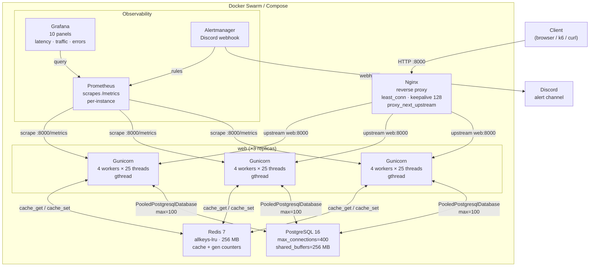
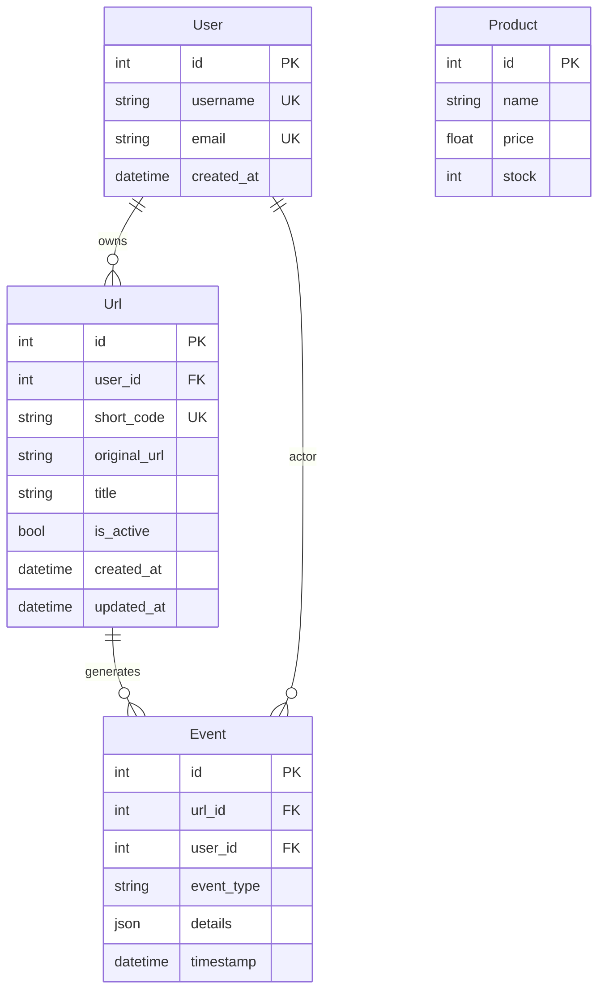

# Architecture

## System Diagram



---

## Request Flow

```
Client
  └─▶ Nginx (:8000)
        ├─ least_conn load balance → one of 3 Gunicorn replicas
        │    ├─ before_request: db.connect(reuse_if_open=True)
        │    ├─ cache_get(key) → Redis
        │    │    ├─ HIT  → return cached JSON  (~1ms)
        │    │    └─ MISS → query PostgreSQL via Peewee ORM
        │    │                └─ cache_set(key, data, ttl)
        │    ├─ log_event_async() → ThreadPoolExecutor (fire-and-forget)
        │    │    └─ background thread: Event.create() → PostgreSQL
        │    └─ teardown_appcontext: db.close() → return conn to pool
        └─ 302 / 200 / 4xx / 5xx → Client
```

---

## Data Model



---

## Caching Strategy

| Endpoint | Key pattern | TTL | Invalidation |
|---|---|---|---|
| `GET /products` | `products` | 60s | Time-based |
| `GET /users` | `users:p{page}:pp{per_page}` | 2s | Time-based |
| `GET /users/:id` | `user:{id}` | 30s | Write-through on PUT |
| `GET /urls` | `urls:uid{uid}:p{page}:pp{per_page}` | 2s | Time-based |
| `GET /urls/:id` | `url:{id}` | 30s | Write-through on PUT |
| `GET /users/:id/urls` | `user_urls:{id}:g{gu}-{gurls}:p{page}:pp{per_page}` | 10s | Generation counter (`GEN_USERS`, `GEN_URLS`) |

**Generation counters** (`gen:users`, `gen:urls`) are incremented in Redis on every write. List caches that change frequently under load use short TTLs (2s) instead of generation keys to avoid constant cache misses when writes are continuous.

---

## Chaos Engineering

Under Docker Swarm, the reconciliation loop enforces desired replica count at all times:

```
docker kill <web-container-id>
      │
      ▼
Swarm detects task exit (condition: any)
      │
      ▼
New task scheduled within 2s (delay: 2s, window: 30s)
      │
      ▼
Nginx proxy_next_upstream retries failed requests
on remaining healthy replicas during transition
      │
      ▼
Zero client-visible errors under load
```

See [RUNBOOK.md](RUNBOOK.md) for step-by-step chaos reproduction commands.

---

## Tech Decisions

See [DECISION_LOG.md](DECISION_LOG.md) for the full rationale behind each technology choice.

| Choice | Reason |
|---|---|
| Gunicorn `gthread` | I/O-bound workload — threads share memory, lower overhead than processes |
| `PooledPostgresqlDatabase` | Eliminates ephemeral port exhaustion under 500 concurrent users |
| Redis `allkeys-lru` | Bounded memory — evicts least-recently-used keys instead of erroring |
| Nginx `least_conn` | Distributes load to the replica with fewest active connections |
| `proxy_next_upstream` | Transparent retry on dead upstream — client never sees a 502 during replica restart |
| Docker Swarm | True self-healing reconciliation loop vs plain Compose `restart:` which only restarts the process |
| Async event writes | Moves DB write off the hot path — redirects return in <5ms regardless of DB latency |
| DB indexes on FK columns | Prevents full table scan on `url.user_id`, `event.url_id`, `event.user_id`, `event.timestamp` |
